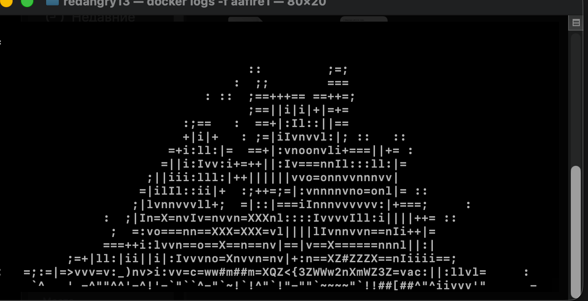
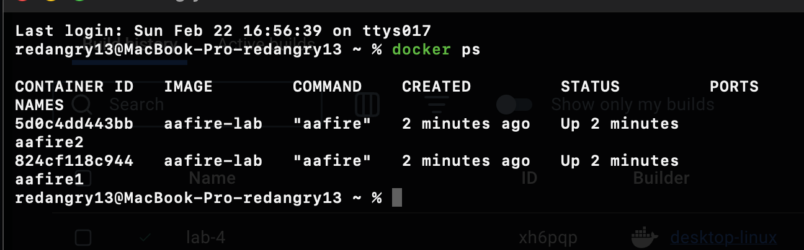
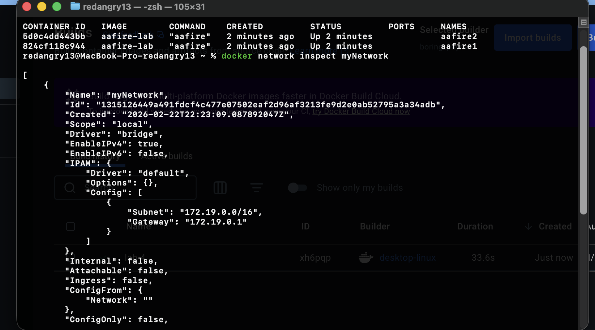

# Лабораторная работа №4. Docker

## Ход работы

### 1. Подготовка Docker-образа

Создан `Dockerfile` на базе `ubuntu:24.04`.
В образ установлены:

- `libaa-bin` (утилита `aafire`)
- `iputils-ping` (для проверки сети между контейнерами)

Сборка образа:

```bash
docker build -t aafire-lab .
```

### 2. Запуск контейнера с aafire

Запуск первого контейнера:

```bash
docker run -dit --name aafire1 aafire-lab
```

Приложение `aafire` работает бесконечно, поэтому контейнер остается в состоянии `Up`.

### 3. Запуск второго контейнера

Во втором терминале запущен второй контейнер:

```bash
docker run -dit --name aafire2 aafire-lab
```

### 4. Создание общей сети

Создана пользовательская сеть:

```bash
docker network create myNetwork
```

Оба контейнера подключены к сети:

```bash
docker network connect myNetwork aafire1
docker network connect myNetwork aafire2
```

Проверка конфигурации сети:

```bash
docker network inspect myNetwork
```

### 5. Проверка связи между контейнерами

Проверка `ping` из `aafire1` в `aafire2`:

```bash
docker exec -it aafire1 ping -c 3 aafire2
```

Проверка `ping` из `aafire2` в `aafire1`:

```bash
docker exec -it aafire2 ping -c 3 aafire1
```

Во всех проверках получены успешные ответы без потерь пакетов.

## Что приложено в отчет

1. Скриншот работы `aafire` в контейнере.
2. Скриншот `docker ps` с двумя работающими контейнерами.
3. Скриншот `docker network inspect myNetwork`.
4. Скриншот успешного `ping` между контейнерами.

## Вывод

Создан и запущен Docker-образ с `aafire`, выполнена настройка сети между двумя контейнерами и подтверждена двусторонняя связность с помощью `ping`.

## Скриншоты






